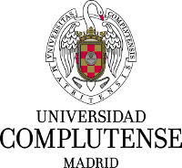

========================
Python polarization
========================

.. image:: https://img.shields.io/pypi/v/py_pol.svg
        :target: https://pypi.org/project/py-pol/

.. image:: https://img.shields.io/travis/optbrea/py_pol.svg
        :target: https://bitbucket.org/optbrea/py_pol/src/master/

.. image:: https://readthedocs.org/projects/py-pol/badge/?version=latest
        :target: https://py-pol.readthedocs.io/en/latest/
        :alt: Documentation Status

* Free software: MIT license
* Documentation: https://py-pol.readthedocs.io/en/latest/

.. image:: logo.png
   :width: 75
   :align: right

Features
----------------
Py-pol is a Python library for Jones and Stokes-Mueller polarization optics. It has 4 main module:

    * jones_vector - for generation of polarization states in 2x1 Jones formalism.

    * jones_matrix - for generation of 2x2 matrix polarizers.

    * stokes - for generation of polarization states in 2x2 Stokes formalism.

    * mueller - for generation of 4x4 matrix polarizers.

Each one has its own class, with multiple methods for generation, operation and parameters extraction.

Examples
-----------

Jones formalism
=================

Generating Jones vectors and Matrices

.. code-block:: python

    from py_pol.jones_vector import Jones_vector
    from py_pol.jones_matrix import Jones_matrix
    from py_pol.utils import degrees

    j0 = Jones_vector("j0")
    j0.linear_light(angle=45*degrees)

    m0 = Jones_matrix("m0")
    m0.diattenuator_linear( p1=0.75, p2=0.25, angle=45*degrees)

    m1 = Jones_matrix("m1")
    m1.quarter_waveplate(angle=0 * degrees)

    j1=m1*m0*j0

Extracting information form Jones Vector.

.. code-block:: python

    print(j0,'\n')
    print(j0.parameters)

.. code-block:: python

    j0 = [+0.707; +0.707]'

    parameters of j0:
        intensity        : 1.000 arb.u
        alpha            : 45.000 deg
        delay            : 0.000 deg
        azimuth          : 45.000 deg
        ellipticity angle: 0.000 deg
        a, b             : 1.000  0.000
        phase            : 0.000 deg

.. code-block:: python

    print(j1,'\n')
    print(j1.parameters)

.. code-block:: python

        m1 * m0 @45.00 deg * j0 = [+0.530+0.000j; +0.000+0.530j]'

        parameters of m1 * m0 @45.00 deg * j0:
            intensity        : 0.562 arb.u
            alpha            : 45.000 deg
            delay            : 90.000 deg
            azimuth          : 8.618 deg
            ellipticity angle: -45.000 deg
            a, b             : 0.530  0.530
            phase            : 0.000 deg

Extracting information form Jones Matrices.

.. code-block:: python

    print(m0,'\n')
    print(m0.parameters)

.. code-block:: python

        m0 @45.00 deg =
              [+0.500, +0.250]
              [+0.250, +0.500]

        parameters of m0 @45.00 deg:
            is_homogeneous: True
            delay:          0.000 deg
            diattenuation:  0.800

.. code-block:: python

    print(m1,'\n')
    print(m1.parameters)

.. code-block:: python

        m1 =
              [+1+0j, +0+0j]
              [+0+0j, +0+1j]

        parameters of m1:
            is_homogeneous: True
            delay:          90.000 deg
            diattenuation:  0.000

Stokes-Mueller formalism
==================================

Generating Stokes vectors and Mueller matrices.

.. code-block:: python

    from py_pol.stokes import Stokes
    from py_pol.mueller import Mueller
    from py_pol.utils import degrees

    j0 = Stokes("j0")
    j0.linear_light(angle=45*degrees)

    m1 = Mueller("m1")
    m1.diattenuator_linear(p1=1, p2=0, angle=0*degrees)

    j1=m1*j0

Extracting information from Stokes vectors.

Determining the intensity of a Stokes vector:

.. code-block:: python

    i1=j0.parameters.intensity()
    print("intensity = {:4.3f} arb. u.".format(i1))

.. code-block:: python

    intensity = 1.000 arb. u.

Determining all the parameters of a Stokes vector:

.. code-block:: python

    print(j0,'\n')
    print(j0.parameters)

.. code-block:: python

        j0 = [ +1;  +0;  +1;  +0]

        parameters of j0:
            intensity             : 1.000 arb. u.
            amplitudes            : E0x 0.707, E0y 0.707, E0_unpol 0.000
            degree polarization   : 1.000
            degree linear pol.    : 1.000
            degree   circular pol.: 0.000
            alpha                 : 45.000 deg
            delay                 : 0.000 deg
            azimuth               : 45.000 deg
            ellipticity  angle    : 0.000 deg
            ellipticity  param    : 0.000
            eccentricity          : 1.000
            polarized vector      : [+1.000; +0.000; +1.000; +0.000]'
            unpolarized vector    : [+0.000; +0.000; +0.000; +0.000]'

.. code-block:: python

    print(j1,'\n')
    print(j1.parameters)

.. code-block:: python

        m1 * j0 = [+0.500; +0.500; +0.000; +0.000]

        parameters of m1 * j0:
            intensity             : 0.500 arb. u.
            amplitudes            : E0x 0.707, E0y 0.000, E0_unpol 0.000
            degree polarization   : 1.000
            degree linear pol.    : 1.000
            degree   circular pol.: 0.000
            alpha                 : 0.000 deg
            delay                 : 0.000 deg
            azimuth               : 0.000 deg
            ellipticity  angle    : 0.000 deg
            ellipticity  param    : 0.000
            eccentricity          : 1.000
            polarized vector      : [+0.500; +0.500; +0.000; +0.000]'
            unpolarized vector    : [+0.000; +0.000; +0.000; +0.000]'

Extracting information from Mueller matrices.

.. code-block:: python

    m2 = Mueller("m2")
    m2.diattenuator_retarder_linear(D=90*degrees, p1=1, p2=0.5, angle=0)
    delay = m2.parameters.retardance()
    print("delay = {:2.1f}º".format(delay/degrees))

.. code-block:: python

    delay = 90.0º

There is a function in Parameters_Jones_Vector class, .get_all() that will compute all the parameters available and stores in a dictionary .dict_params(). Info about dict parameters can be revised using the print function.

.. code-block:: python

    print(m2,'\n')
    m2.parameters.get_all()
    print(m2.parameters)

.. code-block:: python

        m2 =
          [+0.6250, +0.3750, +0.0000, +0.0000]
          [+0.3750, +0.6250, +0.0000, +0.0000]
          [+0.0000, +0.0000, +0.0000, +0.5000]
          [+0.0000, +0.0000, -0.5000, +0.0000]

      Parameters of m2:
          Transmissions:
              - Mean                  : 62.5 %.
              - Maximum               : 100.0 %.
              - Minimum               : 25.0 %.
          Diattenuation:
              - Total                 : 0.600.
              - Linear                : 0.600.
              - Circular              : 0.000.
          Polarizance:
              - Total                 : 0.600.
              - Linear                : 0.600.
              - Circular              : 0.000.
          Spheric purity              : 0.872.
          Retardance                  : 1.571.
          Polarimetric purity         : 1.000.
          Depolarization degree       : 0.000.
          Depolarization factors:
              - Euclidean distance    : 1.732.
              - Depolarization factor : 0.000.
          Polarimetric purity indices:
              - P1                    : 1.000.
              - P2                    : 1.000.
              - P3                    : 1.000.

There are many types of Mueller matrices. The Check_Mueller calss implements all the checks that can be performed in order to clasify a Mueller matrix. They are stored in the checks field of Mueller class.

.. code-block:: python

    m1 = Mueller("m1")
    m1.diattenuator_linear(p1=1, p2=0.2, angle=0*degrees)
    print(m1,'\n')

    c1 = m1.checks.is_physical()
    c2 = m1.checks.is_homogeneous()
    c3 = m1.checks.is_retarder()
    print('The linear diattenuator is physical: {}; hogeneous: {}; and a retarder: {}.'.format(c1, c2, c3))

.. code-block:: python

    m1 =
      [+0.520, +0.480, +0.000, +0.000]
      [+0.480, +0.520, +0.000, +0.000]
      [+0.000, +0.000, +0.200, +0.000]
      [+0.000, +0.000, +0.000, +0.200]

    The linear diattenuator is physical: True; hogeneous: True; and a retarder: False.

Drawings
===========

The modules also allows to obtain graphical representation of polarization.

Drawing polarization ellipse for Jones vectors.

.. image:: ellipse_Jones_1.png
   :width: 600

.. image:: ellipse_Jones_3.png
   :width: 600

Drawing polarization ellipse for Stokes vectors with random distribution due to unpolarized part of light.

.. image:: ellipse_Stokes_1.png
   :width: 600

.. image:: ellipse_Stokes_2.png
   :width: 600

Drawing Stokes vectors in Poincare sphere.

.. image:: poincare2.png
   :width: 600

.. image:: poincare3.png
   :width: 600

.. image:: poincare4.png
   :width: 600

Authors
----------------

* Luis Miguel Sanchez Brea <optbrea@ucm.es>
* Jesus del Hoyo <jhoyo@ucm.es>

    **Universidad Complutense de Madrid**,
    Faculty of Physical Sciences,
    Department of Optics
    Plaza de las ciencias 1,
    ES-28040 Madrid (Spain)

Citing
----------------
L.M. Sanchez Brea, J. del Hoyo "py-pol, python module for polarization optics", https://pypi.org/project/py-pol/ (2019)

References
------------

* D Goldstein "Polarized light" 2nd edition, Marcel Dekker (1993).

* JJ Gil, R. Ossikovsky "Polarized light and the Mueller Matrix approach", CRC Press (2016).

* C Brosseau "Fundamentals of Polarized Light" Wiley (1998).

* R Martinez-Herrero, P.M. Mejias, G.Piquero "Characterization of partially polarized light fields" Springer series in Optical sciences (2009).

* JM Bennet "Handbook of Optics 1" Chapter 5 'Polarization'.

* RA Chipman "Handbook of Optics 2" Chapter 2 'Polarimetry'.

* SY Lu and RA Chipman, "Homogeneous and inhomogeneous Jones matrices",  J. Opt. Soc. Am. A 11(2) 766 (1994).

Acknowlegments
------------------------
This software was initially developed for the project Retos-Colaboración 2016 "Ecograb"  RTC-2016-5277-5: Ministerio de Economía y Competitivdad (Spain) and the European funds for regional development (EU), led by Luis Miguel Sanchez-Brea

Credits
---------

This package was created with Cookiecutter_ and the `audreyr/cookiecutter-pypackage`_ project template.

.. _Cookiecutter: https://github.com/audreyr/cookiecutter
.. _`audreyr/cookiecutter-pypackage`: https://github.com/audreyr/cookiecutter-pypackage
